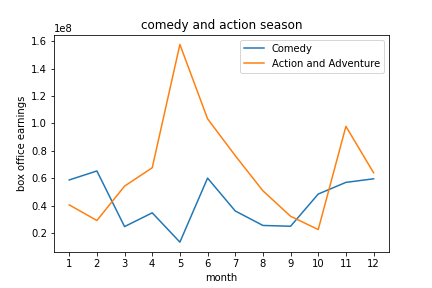

# Microsoft Movie
**Author**: Man Hei Wong
## Overview
Microsoft wants to make a movie, and would like some insight into the current movie industry in order to figure out how to create a successful movie that would generate the most amount of revenue. In this project, I drew data from various movie websites to anlayse correlations between different variables to formulate three recommnedations that would maximize the chances of success. The results indicate that there is a positive correlation between budget and revenue, that the top two genres with highest box office earnings have been Comedy and Action, and that the movies that tend to have highest gross are between 130 and 140 minutes. My recommendations are therefore: 
1. liberally invest into the production of the movie
2. make an Action/ Comedy movie
3. keep the movie around 140 minutes
## Business Problem
It is really hard to guage the types of movies that are performing well or the reason they are successful since there are many characteristics of a movie, like the genre, reputaion of the director/movie studio, time of release, that can be contributing to its appeal. Moreover, there are factors that are difficult to replicate, like the plot or unique cinametography style. I therefore singled out select variables that are easy to control in the production process-namely production budget, genre, and run time- and performed aggregate functions on large amounts of data to find out what has the highest probability of success.
The questions I will be asking are:
1. does a bigger investment into the movie production yield higher returns?
2. what are the average box office earnings of each genre, and are they changing over the years? Do their popularity vary with the time of year?
3. Does the length of the movie correlate to its revenue?
These questions are importang because determining the production budgeti and what genre to make are one of the first decisions one needs to make before figuring out the details like the plot and who to hire for the making process, while the knowing the optimal length of the movie that would likely garner the most amount of profit is a useful guidance when it comes to editing and screenwrting.

## Data
The data being used in my analysis will be pulled from the most popular movie websites that contain the relevant information for answering the questions I have posed. For the analysis of the correlation between budget and profit, I used data from The Numbers, which gives information about the production budget and worldwide gross of more than 5000 movies. Since I want to find the profit made and not just the total revenue, I will be using the metric of gross/budget to measure the return on investment as a function of production budget.
For my second business question on the genre, I used data from Rotten Tomatoes, which includes the genre, theater release date, and the box office earnings of every movie. I used these variables to find the earnings of different gernres over the years to find consistently popular or increasingly popular genres. For the top two genres in terms of revenue, I also analysed their earnings by month to see if there are certain seasons in which the genre is particularly popular.
Finally for the third question about the runtime and revenue, I used the runtime length and box office earnings provided bny Rotten Tomatoes to find the earnings as a function of runtime.

## Methods
For the analysis of budget abd profit, I first eliminated the outliers (movies with either budget or profit higher than the 75th percetnile of all data points). This is because extreme cases where one puts a lot of money into the production or a movie that makes an astronomical amount of money are very rare with very few data points, and are therefore likely not representative of the general trend. On the contrary, there are quite a few movies that are on the lower end of the extreme (<= 25th percentile) and would be useful for the analysis. I plotted these data points as a scatter plot and added a linear trend line using the method of least squares to indicate the general correlation between budget and profit. 
As for investigating genre success, I first found the top 5 most frequently made genres because they have the most amount of data points. Having a sufficient amount of data points controls for the different variables that can contribute to a movie's success, and therefore does a better job in singling out genre as a varibale relating to revenue. I then grouped the movies by genre, then grouped each of the five genres by year and took the average of their respective box office earnings in any given year. This would give one a guage of the success of each genre over the years. Similar to the method above, I made a scatter plot and added trend line for each genre to give a clear view of the general trend over the years. To investugate the ideal time to release the movie, I also took all the movies from the top two genres and grouped them by month, and made a line plot of their average earnings each month. Since I was trying to find how thrit success would rise and fall over the year to find the peak season for each, I used a line plot instead of a scatter plot with a trend line, since the nonlinearity is of interest instead of the generalized linear trend.
Similarly, for the relationship between runtime and box office earnings, I grouped the movies by their runtime rounded to the nearest ten minutes- since I was interested in the rough time range and having movies that differ by a few minutes to be two different data points would greatly crowd the graph- then took the mean of the box office earnings of each group to make a line plot of earnigns over runtime. However, I noticed many data points on either ends of the runtime spectrum had only 1 to 2 plot points, which would not make a good representation of movies of that runtime in general. I therefore removed the data points consisting of less than 9 movies.

## Results
### budget and profit ratio

As seen above, there seems to be a positive correlation between production budget and profit ratio, with a budget line of about 10 million dollars below which movies are more likely to suffer a loss than a gain. 
Cosidering the vast amount of movie data points taken into account, this seems to be a pretty good generalization and can be extrapolated to movies beyond the ones listed in the website. However, the data points are very scattered and the correlation is not very strong, therefore while it can be taken into account when considering how much to invest, one must keep in mind the break even line is only a very rough estimate. 
### genres over the years

According to this graph, Action movies have been consistently earning the most amount of money up until 2014, where it was overtaken by comedy. Moreover, comedy is the only genre on an upward trend.
### genre and time of release

Here we can that the two genres expreinece significant peaks and falls in box office earnings depedning on the time of year. Comdey earnings peak at Februrary and June, while Action peaks at May and November respectively.
I think this informaton can be extrapolated to all movies of that genre because taking the mean of all movies gives a good estimate of how well the genre is doing in the box office. However, I did not take into account the standard deviation of the earnings, which should be considered when trying to figure out how probable a genre of movie would have box office revenue close to the mean. 
### runtime and revenue

For the runtime and revenue, there seems to be a point of diminishing returns at runtime= 130 minutes, before which the earnigns exponentially increases as the runtime increases.
Since I have eliminated the runtimes where there are too few data points (less than 9), and the database of movies from which this graph was made are very varied such that the only variable they share is the runtime, I think this correlation between revenue and runtime have reasonable predictive power of success.
## Conclusions
In a nutshell, based on my analysis presented above, I have found a positive correlation between production budget and profit, and runtime and box office earnings. Moreover, I found the top two genres- Action and Comedy, that had been the most consistent in public appeal over the years, and also found the respective ideal times to release movies of these two genres. It was from these conclusions drawn that my three recommendations stated in the overveiw were formulated, to reiterate, they are: 
1. liberally invest into the production of the movie
2. make an Action/ Comedy movie
3. keep the movie around 140 minutes
These recommendations were based on the overall highest probability of earning the most amount of revenue from the pool of samples I was able to obtain from two credible movie sites. However, these only provide general guidance that highlight the characteristics that successful movies tend to have, and one must keep in mind that correlation does not necessarily mean causation. Moreover, there are also many more factors that contribute to success that I was not able to address, like the plot structure and actors to hire. Regardless, I hope the information provided was usefull for giving one a good guage of what the movie industry is currently like, and its most apparent trends.

## For More Information

Please review our full analysis in [](./dsc-phase1-project-template.ipynb) or our [presentation](./DS_Project_Presentation.pdf).

For any additional questions, please contact **Beatrix Wong, beatrix.wmh@hotmail.com**

## Repository Structure
```
├── README.md                           <- The top-level README for reviewers of this project
├── dsc-phase1-project-template.ipynb   <- Narrative documentation of analysis in Jupyter notebook
├── DS_Project_Presentation.pdf         <- PDF version of project presentation
├── data                                <- Both sourced externally and generated from code
└── images                              <- Both sourced externally and generated from code
```